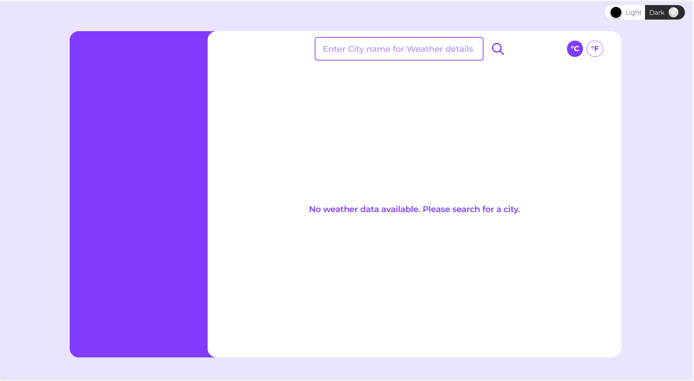
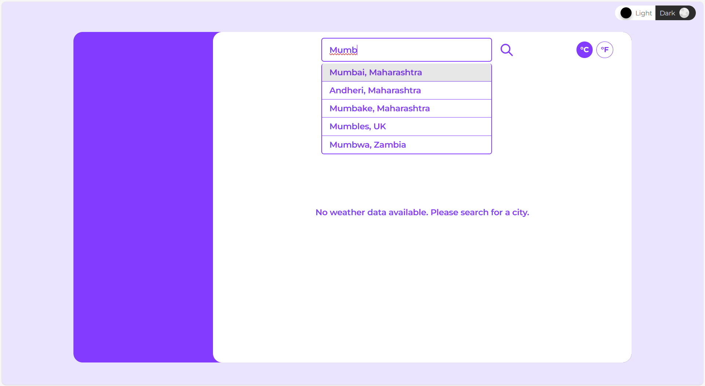
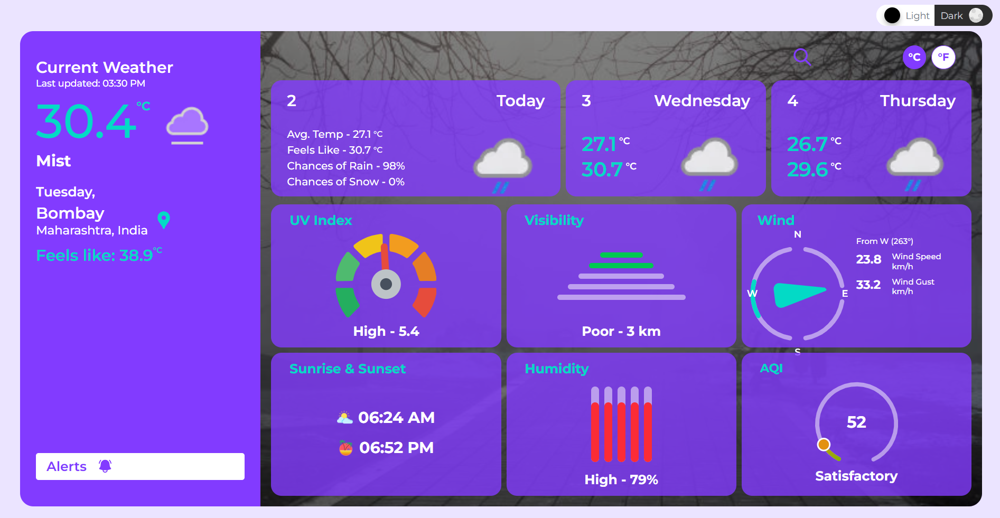
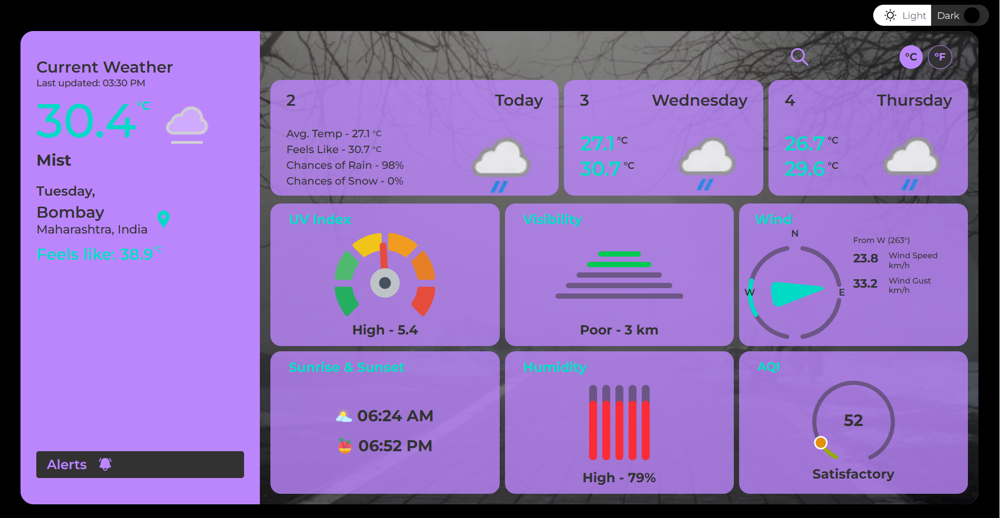

# 🌤️ Weather App

A sleek weather application that lets you **search for any city worldwide** with Google Maps autocomplete and get **detailed weather data** using [WeatherAPI](https://www.weatherapi.com/). Built as a learning project, but useful for anyone who wants quick, accurate weather insights.

## ✨ Features

- 🔍 **City Search with Autocomplete** – Powered by Google Maps API.
- 📍 **Location-based Weather Data** – Current conditions fetched via WeatherAPI.
- 🌡️ **Current Weather Details**
  - Temperature & “Feels Like”
  - Sunrise & Sunset (Astro)
  - Air Quality Index (AQI)
  - UV Index
  - Humidity
  - Wind details
  - Visibility
- 📅 **3-Day Forecast** – Average temp, feels-like, rain/snow chances.
- 🎨 **Custom Weather Visuals** – Dynamic SVG elements update to represent real data (not static icons).
- 🌙 **Light/Dark Theme Toggle**.
- 🎬 **Smooth Animations** – Framer Motion for card transitions, staggered highlights.
- 🧩 **Highlights Section** – Key metrics (Astro, AQI, UV, Humidity, Wind, Visibility).

---

## 🛠️ Tech Stack

- **Frontend:** React 19, TailwindCSS, Framer Motion
- **State Management:** Redux Toolkit + React-Redux
- **APIs:**
  - WeatherAPI – Weather data
  - Google Maps API – Autocomplete for city search
- **Utilities:** Zod (schema validation), React Icons

---

## 🚀 Installation & Setup

1. Clone the repository:

   ```bash
   git clone https://github.com/akshitjain3/weather-app
   cd weather-app
   ```

2. Install dependencies:

   ```bash
   npm install
   ```

3. Create a `.env` file in the root directory and add your API keys:

   ```env
   VITE_WEATHER_API_KEY=your_weather_api_key
   VITE_GOOGLE_APIKEY=your_google_maps_api_key
   ```

4. Run the app locally:
   ```bash
   npm run dev
   ```

---

## 📸 Screenshots

Here’s a sample screenshot placeholder (replace with your actual screenshot later):







## 

## 🌐 Live Demo

👉 [Hosted App Link](https://akshitjain3.github.io/weather-app/)

---

## 🔮 Future Improvements

- Make UI fully responsive (mobile-first design).
- Add support for hourly forecasts.
- Save recent searches locally.
- Multi-language support.

---

## 📚 Learning Outcomes

This project helped me practice:

- API integration with external services (WeatherAPI + Google Maps).
- State management with Redux Toolkit.
- UI animations with Framer Motion.
- Building reusable, dynamic components with TailwindCSS + React.
